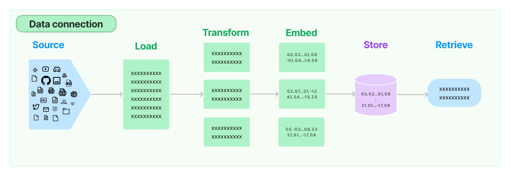
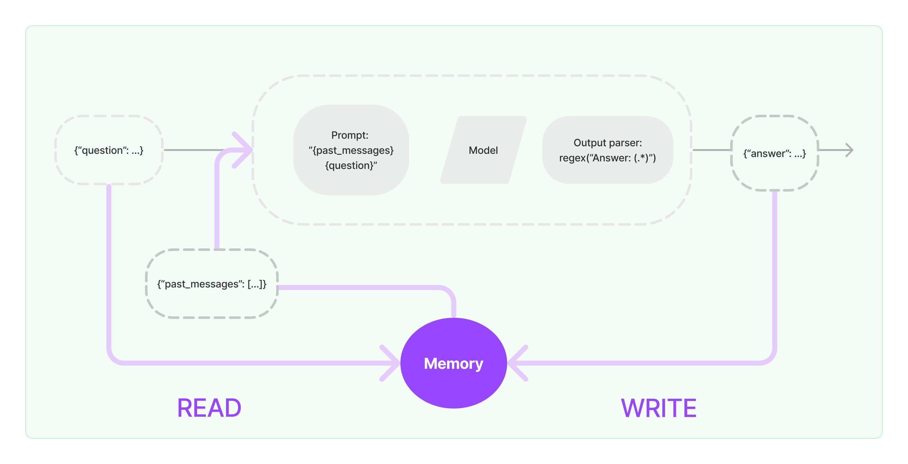
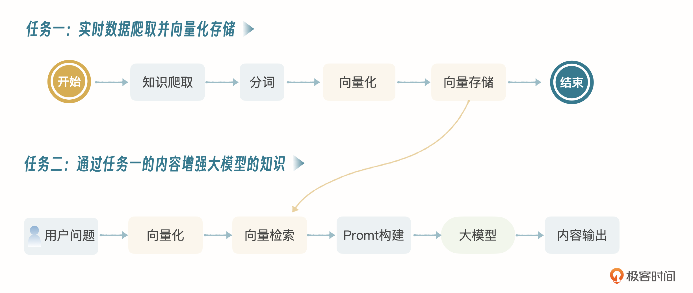
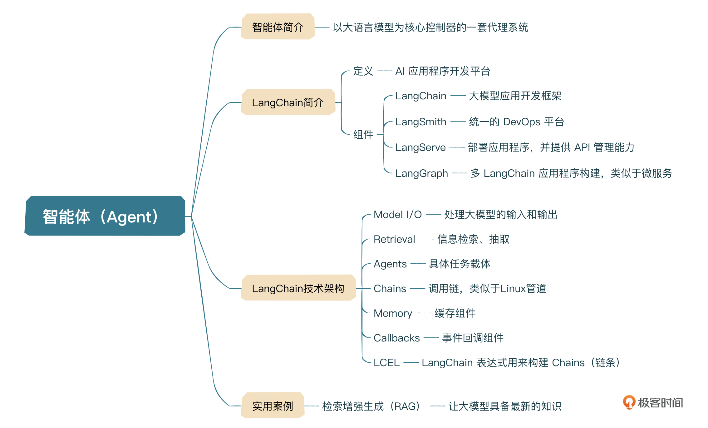

# AI 大模型在使用的过程中的一些局限 与 解决
1. 数据的及时性：
大部分 AI 大模型都是预训练的，拿 ChatGPT 举例，3.5 引擎数据更新时间截止到 2022 年 1 月份，4.0 引擎数据更新时间截止到 2023 年 12 月份，也就是说如果我们问一些最新的信息，大模型是不知道的。
2. 复杂任务处理：
虽然 AI 大模型在问答方面表现出色，但它们并不总是能够处理复杂的任务，比如直接编辑或优化 Word 文档或 PDF 文件。这些任务通常需要特定的软件工具和用户界面，而大模型主要是基于文本的交互（多模态除外）。
3. 代码生成与下载：我们希望大模型根据需求描述生成对应的代码，并提供下载链接，大模型也是不支持的。
4. 与企业应用场景的集成：
在和企业应用场景打通的时候，我们希望大模型读取关系型数据库里的数据，并根据提示进行任务处理，同样大模型也是不支持的。

这样的场景非常多，因为大模型的核心能力是意图理解与文本生成，而在我们实际应用过程中，输入数据和输出数据不仅仅是纯文本。很多时候我们需要解析用户的输入，比如把 Word 或 PDF 文件转化为纯文本，从一个关系型数据库读取数据转化为大模型的输入数据，将大模型的输出内容进行压缩打包并上传至网站供用户下载等等

## 解决：
通过 AI 智能体 也叫 AI Agent 来完成这些任务

# AI Agent
AI Agent 就是以大语言模型为核心控制器的一套代理系统。

如果把人的大脑比作大模型的话，眼睛、耳朵、鼻子、嘴巴、四肢等联合起来叫做 Agent，眼睛、耳朵、鼻子感知外界信号作为大脑的输入；嘴巴、四肢等根据大脑处理结果形成反馈进行输出，形成以大脑为核心控制器的一套系统。

目前比较流行的 Agent 技术有 AutoGen、LangChain 等

# LLangChain：大模型应用开发框架
## LangChain 4 大组件
- LangSmith：统一的 DevOps 平台，用于开发、协作、测试、部署和监控大模型应用程序，同时，LangSmith 是一套 Agent DevOps 规范，不仅可以用于 
- LangChain 应用程序，还可以用在其他框架下的应用程序中。
- LangServe：部署 LangChain 应用程序，并提供 API 管理能力，包含版本回退、升级、数据处理等。
- LangGraph：一个用于使用大模型构建有状态、多参与者应用程序的库，是 2024 年 1 月份推出的。

放到我们传统软件开发场景中，我认为 LangChain 就类似于 SpringCloud；LangSmith 类似于 Jenkins + Docker + K8s + Prometheus；LangServe 类似于 API 网关；LangGraph 类似于 Nacos；当然只是简单比拟。

## LangChain 框架
接下来我们看一下目前 LangChain 整个平台技术体系，不包含 LangGraph，LangChain 框架本身包含三大模块。
- LangChain-Core：基础抽象和 LangChain 表达式语言。
- LangChain-Community：第三方集成。
- LangChain：构成应用程序认知架构的链、代理和检索策略。

## 模型 I/O（Model I/O）
- 格式化（Format）
不论它来源于搜索引擎、向量数据库还是第三方系统接口，都必须先对数据进行格式化，转化成大模型能理解的格式
- 预测（Predict）
预测是指 LangChain 原生支持的丰富的 API，可以实现对各个大模型的调用。
- 解析（Parse）
解析主要是指对大模型返回的文本内容的解析，随着多模态模型的日益成熟，相信很快就会实现对多模态模型输出结果的解析。

## Retrieval 检索
从各种数据源中将数据抓取过来，进行词向量化 Embedding（Word Embedding）、向量数据存储、向量数据检索的过程


## Agent 代理
指实现具体任务的模块，比如从某个第三方接口获取数据，用来作为大模型的输入，那么获取数据这个模块就可以称为 XXX 代理

## Chains
链条就是各种各样的顺序调用，类似于 Linux 命令里的管道。可以是文件处理链条、SQL 查询链条、搜索链条等等。LangChain 技术体系里链条主要通过 LCEL（LangChain 表达式）实现。既然是主要使用 LCEL 实现，那说明还有一部分不是使用 LCEL 实现的链条，也就是 LegacyChain，一些底层的链条，没有通过 LCEL 实现。

## Memory
内存是指模型的一些输入和输出，包含历史对话信息，可以放入缓存，提升性能


## Callbacks 回调
LangChain 针对各个组件提供回调机制，包括链、模型、代理、工具等

## LCEL
LangChain 表达式，前面我们介绍 Chains（链）的时候讲过，LCEL 是用来构建 Chains 的
- 使用：
```python
from langchain_core.output_parsers import StrOutputParser
from langchain_core.prompts import ChatPromptTemplate
from langchain_openai import ChatOpenAI

prompt = ChatPromptTemplate.from_template("tell me a short joke about {topic}")
model = ChatOpenAI(model="gpt-4")
output_parser = StrOutputParser()

chain = prompt | model | output_parser

chain.invoke({"topic": "ice cream"})
```
通过特殊字符 | 来连接不同组件，构成复杂链条，以实现特定的功能。
- 如
```python
chain = prompt | model | output_parser
```
当然，我们也可以通过 LCEL 将多个链关联在一起。
- 如：
```python
chain1 = prompt1 | model | StrOutputParser()
chain2 = (
    {"city": chain1, "language": itemgetter("language")}
    | prompt2
    | model
    | StrOutputParser()
)
chain2.invoke({"person": "obama", "language": "spanish"})
```

## LangChain 核心思想
1. 大模型是核心控制器，所有的操作都是围绕大模型的输入和输出在进行。
2. 链的概念，可以将一系列组件串起来进行功能叠加，这对于逻辑的抽象和组件复用是非常关键的。

# Agent 使用案例——RAG
## 问题 知识滞后
大模型是基于预训练的，一般大模型训练周期 1～3 个月，因为成本过高，所以大模型注定不可能频繁更新知识。正是这个训练周期的问题，导致大模型掌握的知识基本上都是滞后的
## 解决 RAG
如果我们想要大模型能够理解实时数据，或者把企业内部数据喂给大模型进行推理，我们必须进行检索增强，也就是常说的 RAG，检索增强生成。
## 示例

通过任务一、二的结合，大模型就可以使用最新的知识进行推理了，这里只是示例，实际要综合成本、性能等多方面因素去选择最合适的技术方案
- 任务一：先通过网络爬虫，爬取大量的信息，这个和搜索引擎数据爬取过程一样，当然这里不涉及 PR（Page Rank），只是纯粹的知识爬取，并向量化存储，为了保障我们有最新的数据。
- 任务二：用户提问时，先把问题向量化，然后在向量库里检索，将检索到的信息构建成提示，喂给大模型，大模型处理完进行输出。
### 向量化
向量化就是将语言通过数学的方式进行表达
- 比如男人这个词，通过某种模型向量化后就变成了类似于下面这样的向量数据：
```[0.5,−1.2,0.3,−0.4,0.1,−0.8,1.7,0.6,−1.1,0.9]```
此处只是举例，实际使用过程中男人这个词生成的向量数据取决于我们使用的 Embedding 模型
### 向量存储
向量存储就是将向量化后的数据存储在向量数据库里，常见的向量数据库有 **Faiss**、 **Milvus**

# 小结
目前看来，智能体很有可能在未来一段时间内成为 AI 发展的一个重要方向。因为大模型实际上是大厂商的游戏（除非未来开发出能够低成本训练和推理的大模型），而智能体不一样，普通玩家一样可以入局
