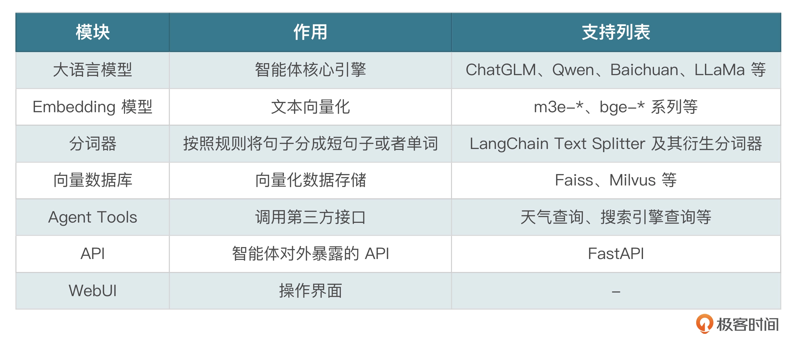
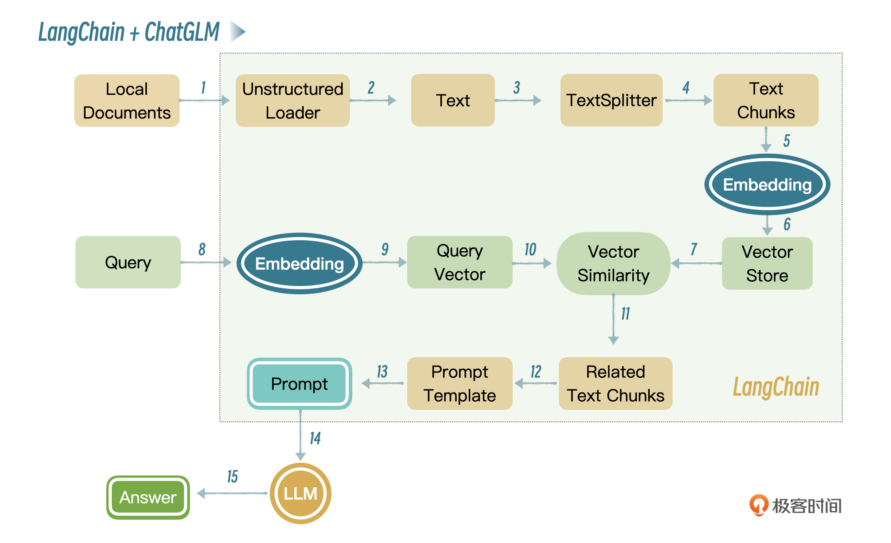

# 基于 ChatGLM3-6B + langchain + faiss 搭建知识库

## 知识库 较 微调的好处
1. 知识准确：先把知识进行向量化，存储到向量数据库里，使用的时候通过向量检索从向量库把知识检索出来，这样可以确保知识的准确性。
2. 更新频率快：当你发现知识库里的知识不全的时候，可以随时补充，不需要像微调一样，重新跑微调任务、验证结果、重新部署等。

# Langchain-Chatchat 架构
Langchain-Chatchat 主要包含几个模块：大语言模型、Embedding 模型、分词器、向量数据库、Agent Tools、API、WebUI。
各模块作用：


## 基本工作流程


1～7 是文档完成向量化存储的过程，8～15 是知识库检索的过程。

### 国内类似的知识库搭建的 已开源解决方案、应用开发平台
1. Dify
https://docs.dify.ai/zh-hans
2. FastGPT
https://doc.tryfastgpt.ai/docs/

## 项目地址
https://github.com/chatchat-space/Langchain-Chatchat.git

## Langchain-Chatchat 部署
### 依赖安装
除去 requirements 中包含依赖，
需要安装对应的 向量数据库 Faiss： https://github.com/facebookresearch/faiss/wiki
也可以替换为国内的向量数据库 Milvus：https://milvus.io/docs/zh/quickstart.md
### 模型下载
下载对应的 大模型 及 Embedding 模型
同样可以借助 魔塔 或者 HuggingFace 

### 初始化向量数据库，启动

### 知识管理
可以直接通过 Langchain-Chatchat 的 web-ui 上进行操作

# 向量
在计算机科学和数学中，向量是由一系列数字组成的数组，这些数字可以表示任何东西，从物理空间的方向和大小到商品的特性和用户偏好等。
## 向量相似度计算
比如，某一物品喜好推荐的场景，通过多个维度向量描述物品的每个特征，及用户对每个相关特征的关注程度。
如电影中的 剧情、演技、特效、音乐，每个特征 和 用户对于各个特征的喜好程度都可以通过相应的向量进行描述。
为了找到最为匹配用户喜好的电影。可以根据用户喜好的电影对应的特征向量，去匹配所有电影的特征评分。
这个匹配过程，即是向量相似度的计算
**计算向量之间的欧氏距离或余弦相似度。距离越小或相似度越高，表示电影越符合用户的口味**
## 文本向量
NLP 中一个词的向量值，是通过大量的文本训练上得到的，通过不同的 Word2Vec 模型训练，即使是相同的词，得到的向量可能是不一样的，因为它们可能基于不同的文本集或使用不同的参数训练。

- 如下方法，借助 GoogleNews-vectors-negative300.bin 模型，计算 man 和 boy 的相似度：
```py
import numpy as np
from gensim.models import KeyedVectors
model = KeyedVectors.load_word2vec_format('GoogleNews-vectors-negative300.bin', binary=True)
def cosine_similarity(vec_a, vec_b):
    # 计算两个向量的点积
    dot_product = np.dot(vec_a, vec_b)
    # 计算每个向量的欧几里得长度
    norm_a = np.linalg.norm(vec_a)
    norm_b = np.linalg.norm(vec_b)
    # 计算余弦相似度
    return dot_product / (norm_a * norm_b)
# 获取man和boy两个词的向量
man_vector = model['man']
boy_vector = model['boy']
# 打印出这两个向量的前10个元素
print(man_vector[:10])
print(boy_vector[:10])
similarity_man_boy = cosine_similarity(man_vector, boy_vector)
print(f"男人和男孩的相似度: {similarity_man_boy}")
```
常见的 Word2Vec 模型会生成几百维的向量
信息检索的时候，不需要像传统数据库那样通过 like 去找相似的内容，而是通过向量相似度去检索相似的内容。
这样做的好处是可以通过多个维度（属性）去比较，比如男人和男孩相似度很高，是因为男人和男孩在性别、社会角色、关系、活动和兴趣、情感和行为等方面都比较相似。

## 向量存储
存储向量数据有专门的向量数据库，比如 Faiss、Milvus。向量数据库专门被设计用于存储和检索向量数据，非常适合处理词向量、图像特征向量或任何其他形式的高维数据。
- 如：
```py
import numpy as np
import faiss

# 假设我们有一些词向量，每个向量的维度为100
dimension = 100  # 向量维度
word_vectors = np.array([
    [0.1, 0.2, ...],  # 'man'的向量
    [0.01, 0.2, ...],  # 'boy'的向量
    ...  # 更多向量
]).astype('float32')  # Faiss要求使用float32

# 创建一个用于存储向量的索引
# 这里使用的是L2距离（欧氏距离），如果你需要使用余弦相似度，需要先规范化向量
index = faiss.IndexFlatL2(dimension)

# 添加向量到索引
index.add(word_vectors)

# 假设我们想找到与'new_man'（新向量）最相似的5个向量
new_man = np.array([[0.1, 0.21, ...]]).astype('float32')  # 新的查询向量
k = 5  # 返回最相似的5个向量
D, I = index.search(new_man, k)  # D是距离的数组，I是索引的数组

# 打印出最相似的向量的索引
print(I)
```

# 知识库模式应用场景
知识库模式可以用在相对固定的场景做推理，比如企业内部使用的员工小助手，包含考勤制度、薪酬制度、报销制度、法律帮助，以及产品操作手册、使用帮助等等，这类场景不需要太多的逻辑推理，使用知识库模式检索精确度高，并且可以随时更新。