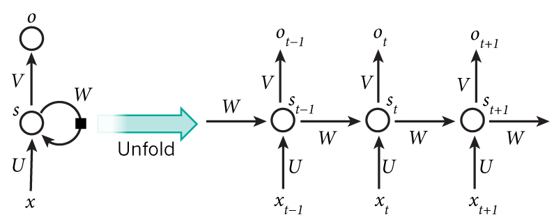
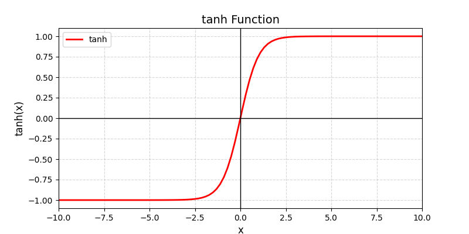
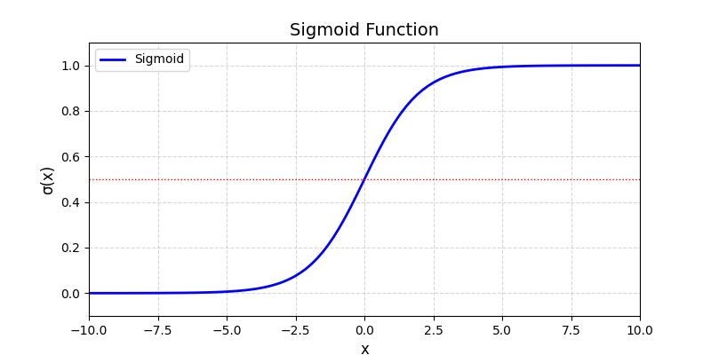

# 循环神经网络（RNN）
实际上目前大多数的大模型都是基于 transformer 的，通过了解 RNN 可以理解神经网络如何处理序列中的依赖关系、记忆过去的信息，并在此基础上，生成预测的基本概念，尤其是几个关键问题，比如 **梯度爆炸问题** 和 **梯度消失问题**

# RNN 基本原理
## 基本描述

图中可以看出，神经网络在处理数据是，可以看到 t 前后，即前一时刻 和 后一刻的状态，即上下文

想象你在读一本小说，​每一页的内容都依赖于前面的剧情发展。如果你突然忘记前面所有的情节，只看当前这一页，可能完全看不懂。
RNN 就像一个“有记忆的读者”​：它每次读一个词（或一个数据点），不仅看当前的内容，还会记住之前读过的信息，从而理解整个故事的上下文关系。

## RNN 的核心特点
- ​记忆能力：RNN 内部有一个“记忆盒子”（隐藏状态），保存之前处理过的信息。
- ​逐步处理序列：比如一句话、一段语音、股票价格的时间序列等。
- ​共享参数：无论处理第1个词还是第100个词，都用同一套规则（权重参数），节省资源。

- tanh：双曲正切函数激活函数
    - 激活函数：是固定的非线性函数（如 tanh），用来让模型学习复杂模式。

## 举个生活中的例子：预测下一个词
任务：根据句子前半部分，预测下一个词是什么。
比如，输入句子：“我想吃__”，预测下一个词可能是“苹果”或“面条”。
### 其中 RNN 的工作流程
1. ​初始化记忆盒子：
    - 刚开始，记忆盒子是空的（隐藏状态初始化为0）。
2. ​处理第一个词“我”​：
    - 把“我”输入 RNN。
    - RNN 结合“我”和当前记忆盒子（空），更新记忆盒子，并输出一个预测（这一步可能不准确）。
3. ​处理第二个词“想”​：
    - 把“想”输入 RNN。
    - RNN 结合“想”和更新后的记忆盒子（已记住“我”），再次更新记忆盒子，输出预测。
4. ​处理第三个词“吃”​：
    - 把“吃”输入 RNN。
    - RNN 结合“吃”和记忆盒子（已记住“我想”），更新记忆盒子，并预测下一个词。
    - 此时记忆盒子知道：“我 + 想 + 吃”，所以预测下一个词更可能是食物（如“苹果”）。
### 关键点
- 记忆盒子（隐藏状态）​：不断传递和更新，保存上下文信息。
- ​参数共享：处理每个词用的是同一套规则（使用相同的权重矩阵来处理输入和传递信息），不需要为每个词单独学习。

## 更简单的例子：数数有多少个字母“A”​
假设输入序列是：['B', 'A', 'A', 'C', 'A']，要求每读一个字母，输出当前累计的“A”的数量。
### ​RNN 处理步骤：
1. 输入 B → 记忆盒子记住“非A”，输出 ​0。
2. 输入 A → 记忆盒子记住“1个A”，输出 ​1。
3. 输入 A → 记忆盒子记住“2个A”，输出 ​2。
4. 输入 C → 记忆盒子保持“2个A”，输出 ​2。
5. 输入 A → 记忆盒子记住“3个A”，输出 ​3。
RNN 的表现：每一步都依赖之前的记忆，最终正确统计了3个A。

## RNN 的缺点
- ​短期记忆问题：如果序列太长（比如1000个词），早期的信息可能被“遗忘”（梯度消失）。
- ​解决方案：更强大的变体如 ​LSTM（长短期记忆网络）​ 或 ​GRU（门控循环单元）​，它们能记住更久远的信息。

## 总结
- ​RNN 就像一个有记忆的流水线工人，一边处理当前任务，一边记住之前的工作内容。
- ​适用场景：自然语言处理（如聊天机器人）、时间序列预测（如股票价格）、语音识别等。
- ​关键优势：能处理序列数据，理解上下文依赖关系。

## 更形象的比喻
​普通神经网络：像一张照片，只能看瞬间的画面。
​RNN：像一段视频，能理解前后帧的关系。

## 激活函数，及多种激活函数对比
| 激活函数   | 优点                          | 缺点                          | 适用场景               |
|------------|-------------------------------|-------------------------------|------------------------|
| **ReLU**   | 计算快，缓解梯度消失          | 死亡神经元，输出非对称        | 大多数前馈网络         |
| **tanh**   | 输出对称，数值稳定            | 梯度消失风险中等              | RNN、输出需对称的场景  |
| **LeakyReLU** | 缓解死亡神经元                | 需调参（负斜率α）             | 深层网络               |
| **Swish**  | 平滑，自适应梯度              | 计算略复杂（含Sigmoid）       | 实验性替换 ReLU        |

# 梯度消失 和 梯度爆炸
## 通俗理解
想象你在教一个机器人走路，每次它迈错步子时，你会告诉它“该调整哪条腿的力度”。
- 梯度消失：机器人走到第100步时，你给的反馈（梯度）变得极其微弱，它几乎不知道前几步哪里错了，导致它永远学不会走路。
- ​梯度爆炸：你的反馈突然变得超级夸张，机器人猛地扭动身体，直接摔倒，再也站不起来了。
- 本质：在深度神经网络中，梯度是调整参数的“指导信号”。反向传播时，梯度需要从输出层传递到输入层。如果信号越来越小（梯度消失）或越来越大（梯度爆炸），模型就无法正常学习了。
## why？ happened
- 梯度消失：
    当网络层数很深时，梯度通过链式法则逐层相乘。如果每层的梯度值都小于1（如使用sigmoid激活函数），连乘后会指数级缩小。
    ​举个栗子：
        0.5（梯度） × 0.5 × 0.5 × ... × 0.5（100层） ≈ 0（几乎消失）
- 梯度爆炸：
    如果梯度值大于1（如权重初始化过大），连乘后会指数级增长，导致数值爆炸。
    ​举个栗子：
        1.5（梯度） × 1.5 × 1.5 × ... × 1.5（100层） ≈ 天文数字（爆炸）

# 解决方案
## 梯度消失解决
1. 换激活函数：用 ReLU 代替 sigmoid 或 tanh。
    ​为什么有效：ReLU在正区间的导数是1，不会压缩梯度。
    ​举个栗子：用一根“直管道”传递信号，而不是“越传越细的软管”。
2. ​残差连接（ResNet）​：给网络加“捷径”。
    ​为什么有效：梯度可以直接跳过某些层，避免被反复压缩。
    ​举个栗子：爬山时走盘山路太累？直接开一条隧道抄近道。
3. ​批量归一化（BatchNorm）​：稳定每层的输入分布。
    ​为什么有效：防止某些层的梯度忽大忽小，让信号传递更平稳。
4. ​​LSTM（长短期记忆网络）​ / ​GRU（门控循环单元）（针对 RNN ）​：用门控机制控制记忆。保留长期依赖信息，从而避免梯度在反向传播过程中消失。
    ​为什么有效：像给网络装了个“调节阀”，选择记住或忘记历史信息，避免长期依赖问题。

## 梯度爆炸解决
1. 梯度裁剪（Gradient Clipping）​：设定梯度最大值。
    ​为什么有效：强行把过大的梯度“削”到合理范围。
    ​举个栗子：给机器人装个“安全带”，防止它动作太夸张。
2. ​权重正则化（L2正则化）​：惩罚过大的权重。
    ​为什么有效：防止参数增长失控，间接控制梯度幅度。
3. ​合适的权重初始化：如 Xavier 或 He  初始化。
    ​为什么有效：让每层的输入输出方差相近，避免初始梯度过大或过小。

# 长短期记忆（LSTM）
LSTM 像一个有“选择性记忆”的管家，只记住重要的信息，丢掉无关的垃圾，并在需要时精准调取记忆。
## 解决什么问题
想象你正在读一本侦探小说，凶手在第一章被提到，但直到最后一章才揭晓。普通的 ​RNN（循环神经网络）​ 就像记忆力差的人，读到后面章节时，可能已经忘了第一章的关键线索。这就是 ​短期记忆问题——普通RNN难以记住长期依赖关系。

LSTM 的设计目标：让神经网络像“侦探”一样，记住重要的早期信息，并在需要时精准调用。

## 核心思想、机制
LSTM 通过三个“智能开关”（门控机制）和一个“记忆传送带”（细胞状态）来解决长期记忆问题。
- ​关键组件：
    1. ​遗忘门：决定哪些信息应该被遗忘。
    2. ​输入门：决定哪些新信息应该被记住。
    3. ​输出门：决定当前时刻输出什么信息。
    4. ​细胞状态（记忆传送带）​：长期记忆的核心载体，贯穿整个时间序列。

## 通俗比喻
假设你在厨房做蛋糕，LSTM 就像一条智能流水线：
-​细胞状态（传送带）​：传送带上放着所有食材和步骤（长期记忆）。
- ​遗忘门（质检员A）​：检查传送带上的食材，丢掉过期的（比如发霉的面粉）。
    - “之前的步骤中，哪些信息没用了？”
- ​输入门（质检员B）​：把新鲜的食材（新信息）放到传送带上。
    - “现在的新信息中，哪些值得记住？”
- ​输出门（厨师）​：根据传送带上的食材，决定这一步要做什么（比如打鸡蛋或烤蛋糕）。
    - “基于当前记忆，应该输出什么结果？”
## LSTM 的具体工作流程
以句子 “我爱吃苹果，因为它很甜” 为例，LSTM 如何记住“苹果”并关联到“甜”？
1. ​遗忘门：
    当读到“因为它很甜”时，遗忘门会判断：
    - “我”和“爱”可能不再重要（遗忘），但“苹果”需要保留。
    - 数学操作：用 ​Sigmoid 函数 输出 0~1 的值（0=全忘，1=全记）。
2. ​输入门：
    发现“甜”是描述“苹果”的关键新信息，将其加入细胞状态。
    - 数学操作：用 ​Sigmoid 决定更新哪些信息，用 ​tanh 生成新候选值。
3. ​更新细胞状态：
    - 传送带更新：
        - 丢掉无关信息（如“我”） → 通过遗忘门。
        - 加入新信息（“甜”） → 通过输入门。
4. ​输出门：
    根据当前细胞状态（已记住“苹果”和“甜”），输出预测结果（如判断这句话的情感是“正面”）。

## 为什么可以解决长期依赖问题
- 细胞状态的稳定性：
    传送带（细胞状态）上的信息可以跨越多个时间步传递，几乎不被修改（除非门控决定要改）。
    - 比如记住“苹果”后，即使中间隔了10个词，仍能关联到“甜”。
- ​门控的精准控制：
    三个门通过 ​Sigmoid 函数（输出0~1）动态调节信息流，避免普通RNN的“记忆模糊”问题。

## 实际应用场景
1. ​机器翻译：记住整个句子的主语和动词，再生成对应翻译。
2. ​股票预测：结合数月前的趋势和最新数据预测价格。
3. 文本生成：写小说时保持角色设定的一致性。

## 总结：LSTM 的关键机制
​三个门：遗忘门、输入门、输出门（用 Sigmoid 控制信息比例）。
​细胞状态：长期记忆的“传送带”，通过门控更新和传递。
​核心优势：既能记住长期信息（如第一章的凶手），也能忘记无用细节（如天气描述）。

## Sigmoid 函数
Sigmoid 是一种“S型”曲线函数，能将任意实数映射到 ​**(0, 1)** 之间。

公式：σ(x) = 1/(1 + e ^ (-x))
- 输入：任意实数（如 -∞ 到 +∞）。
- ​输出：0 到 1 之间的值，可以理解为“概率”或“开关强度”。
### 常见应用场景
1. ​二分类输出层：
    例如预测“是/否”、“真/假”，输出值代表概率（如 P(是)=0.8）。
2. ​门控机制（如 LSTM）​：
    用 Sigmoid 控制“遗忘门”、“输入门”、“输出门”的开合程度（0=全关，1=全开）。
3. ​概率建模：
    在贝叶斯网络或概率图模型中表示事件发生的可能性。

