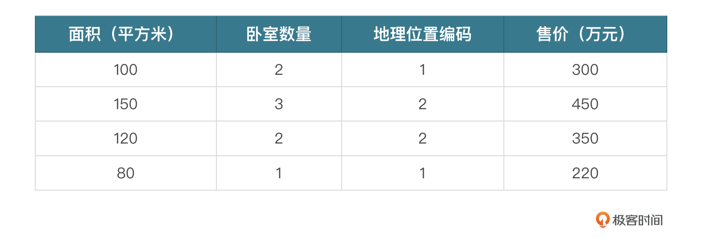
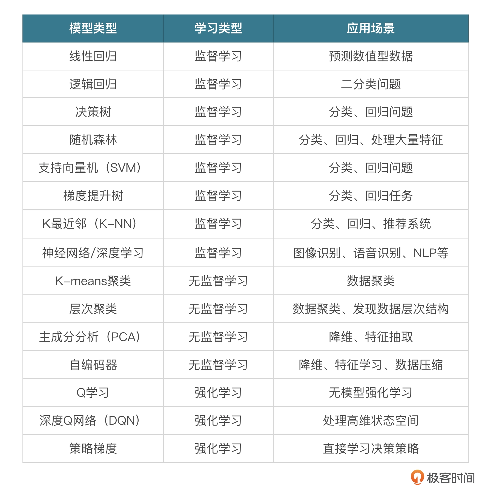

# 概念
通俗来讲，机器学习（Machine Learning，ML）就是让计算机利用数据来“学习”如何完成任务。和传统编程不同，你需要明确地告诉计算机每一步怎么做，机器学习允许计算机通过分析和学习数据来自我改进及作出决策。
- 如简单实现一个地区房价预测：
其中训练的数据集就需要包括很多房屋信息，比如房屋面积、卧室数量、户型结构、地理位置等，以及每个房屋对应的价格。
如下数据集

在传统编程中，你可能需要根据经验编写复杂的规则和公式来估算价格。但在机器学习中，我们让模型自己去“学习”这些规则。
- 简易实现
```py
from sklearn.model_selection import train_test_split
from sklearn.linear_model import LinearRegression
import pandas as pd

# 加载数据集
data = pd.read_csv("housing_data.csv")  # 假设这是我们的房屋数据

# 准备数据
# 特征 X 将是一个 二维数组，包含了面积、卧室数量和地理位置编码这三列 
# 如 [[100, 2, 1],[150, 3, 2],[120, 2, 2],[80, 1, 1]]
X = data[['面积', '卧室数量', '地理位置']]
# 目标变量
# 包含了“售价”这一列。值为 [300, 450, 350, 220]
y = data['售价']

# 划分数据集 
# train_test_split 将数据集分割成训练集和测试集两部分。训练集用于训练模型，而测试集用于评估模型的性能，以检查模型对于未见过的数据的泛化能力。
# test_size 表示测试集在整个数据集中所占的比例
# random_state 用于控制随机数生成器的状态，提供一个确切的值可以确保每次分割都是相同的。
X_train, X_test, y_train, y_test = train_test_split(X, y, test_size=0.2, random_state=42)

# 初始化模型
model = LinearRegression()

# 训练模型
model.fit(X_train, y_train)

# 使用模型进行预测
predictions = model.predict(X_test)

# 现在，`predictions`包含了我们模型预测的房价

```


# 深度学习
深度学习主要以 **深度神经网络（Deep Neural Networks, DNNs）** 为主，神经网络这种结构完全模拟人的大脑结构，由多层神经元组成。我们知道正常成年人的大脑有大约 1000 亿个神经元，每个神经元又和其他大约 1000 个神经元产生连接，每个连接就是我们说的突触，也就是说人的大脑大概有 100 万亿个突触。（数据为大约取值）

平时所说的大模型的参数，其实就类似于突触，GPT-3 有 1750 亿个参数，就是约 1750 亿个突触，除以 1000 的话，GPT-3 大约有 1.75 亿个神经元，智商大约是正常成年人的 0.175%，光从这些数据看，离人类智商还有一定差距。（数据为大约取值）

## 深度神经网络
一个多层的神经网络结构，每一层都可以学习不同级别的特征
### 举例：识别图片中是否有猫
- 基本步骤：
1. 准备数据：包含训练集和测试集。
2. 构建模型：在构建神经网络的时候，可以让前面的层学习边缘和纹理，更深的层则学习如何组合这些特征来识别更复杂的形状和对象，如猫的耳朵、鼻子等。
3. 训练模型：通过输入成千上万张猫的图片来训练网络，通过调整内部参数（权重）使预测错误最小化。
4. 评估和使用：训练完成后，可以用模型来对图片进行分类。
- 分层处理：第二步和第三步会涉及多个层之间的信息处理，一般这些层被分为三种主要类型
1. 输入层：接收原始数据输入，例如图片的像素值。
2. 隐藏层：多个层级，每一层都通过数学函数转换数据，逐步提取和学习数据的特征。较低层可能学习简单特征，如边缘和角点，而更深层则学习复杂特征，如对象的部分和整体结构。
3. 输出层：根据学到的特征作出最终的预测或分类，例如判断图像中是猫还是狗。
在训练过程中，模型通过一种叫作 **反向传播** 的算法自动调整其内部参数（称为权重和偏差），来最小化模型的预测和实际结果之间的差异，整个过程通常需要大量的数据和计算资源

# 机器学习过程 工程化
## 1. 定义问题
明确你希望机器学习解决的问题。比如可能是一个分类问题（如区分图片中是猫还是狗），或者是一个回归问题（如预测房价），也有可能是一个聚类问题（如识别有相似需求的客户群体）。

## 2. 收集数据
数据是机器学习的基础。你需要收集足够多、质量好的数据，这些数据需要能够代表你试图解决的问题。数据可以通过各种方式获取，如公开数据集、公司内部数据、网络爬虫等。

## 3. 数据预处理
收集到的原始数据往往是杂乱无章的。数据预处理的目的是将这些数据转换成一种更适合机器学习算法处理的格式。这包括处理缺失值、异常值、数据标准化、特征选择等步骤。
GPT-3 的 45TB 的数据集，经过预处理，生成大概 750GB 的高质量数据。

## 4. 分割数据
将数据分为训练集和测试集（有时还有验证集）
训练集用于训练模型，测试集用于评估模型的性能。这样做的目的是检验模型对未知数据的泛化能力。

## 5. 选择模型
一些常见的机器学习模型


## 6. 训练模型
训练就是使用训练集数据训练选定的模型。整个过程中，模型会尝试学习数据中的规律和关系，以便在遇到新数据时能够作出准确的预测或分类。有时模型也会自动调整参数（权重），自动进行测试，并调整权重使效果最好

这个过程非常耗费资源，GPT-3 单次训练成本高达近 500 万美金，一般每 3 个月训练一次，一年如果训练 4 次的话，光训练成本就接近 1 亿人民币了。

## 7. 评估模型
使用测试集数据评估模型的性能
常用的评估指标包括准确率、召回率、F1 分数等
经常看到各种各样的模型性能评估基准，有 MMLU、CEval、GSM8K 等
测试榜单：如，https://www.superclueai.com/

## 8. 参数调优和模型优化
根据模型在测试集上的表现，调整模型的参数或进行其他优化，以提高模型的性能
## 9. 部署模型

## 10. 监控和维护
在模型部署后，需要持续监控其性能，并根据新收集的数据定期进行维护和更新。
这是因为随着时间的推移，数据的分布可能会发生变化，这种现象被称为**概念漂移**，可能会导致模型性能下降。

模型维护部分的数据，可以是模型的开发者主动进行收集，也可以在公开的产品内由用户进行反馈，比如现在的大模型产品，ChatGPT、ChatGLM 都有实时的用户反馈（点赞、分享、用户反馈）

# 经典算法

## 线性回归
线性回归是一种预测分析技术，用于研究两个或多个变量之间的关系。
简单来说，它尝试用一条直线（在二维空间中）或一个平面（在三维空间中）等，尽可能地拟合这些变量间的数据点。这条直线或平面可以用来预测或估计一个变量基于另一个变量的值。

假设我们有一个因变量 y 和一个自变量 x。线性回归会尝试找到一条直线 y=ax+b，其中 a 是斜率，b 是截距，以便这条直线尽可能地接近所有数据点。假设你想预测一个地区的房价。这里，房价是因变量 y，而房屋的面积是自变量 x。通过收集一些数据，我们可以用线性回归模型来预测房价。

### 举例房价预测
- 房屋面积及对应价格数据集
面积（平方米）: [35, 45, 40, 60, 65]
价格（万元）: [30, 40, 35, 60, 65]
- 实现 使用这些数据来拟合一个线性回归模型，并预测面积为 50 平方米的房屋的价格。
```py
from sklearn.linear_model import LinearRegression
import numpy as np
import matplotlib.pyplot as plt

# 定义数据
X = np.array([35, 45, 40, 60, 65]).reshape(-1, 1) # 面积
y = np.array([30, 40, 35, 60, 65]) # 价格

# 创建并拟合模型
model = LinearRegression()
model.fit(X, y)

# 预测面积为50平方米的房屋价格
predict_area = np.array([50]).reshape(-1, 1)
predicted_price = model.predict(predict_area)

print(f"预测的房价为：{predicted_price[0]:.2f}万美元")

# 绘制数据点和拟合直线
plt.scatter(X, y, color='blue')
plt.plot(X, model.predict(X), color='red')
plt.title('房价预测')
plt.xlabel('面积（平方米）')
plt.ylabel('价格（万元）')
plt.show()
```
- 运行效果


## 逻辑回归
逻辑回归主要用于处理分类问题，尤其是二分类问题。
它的目的是预测一个事件发生的概率，并将这个概率转换为二元结果：0 或 1、是或否等。
逻辑回归通过使用逻辑函数（也称为 Sigmoid 函数）将线性回归模型的输出映射到 0 和 1 之间的概率值上。
- Sigmoid 函数定义如下：
σ（z）= 1 / (1 + e ** (-z))
z 是线性回归模型的输出，即 z=β0​+β1​x1​+β2​x2​+…+βn​xn​。在这个表达式中，x1​,x2​,…,xn​ 是特征变量，β0​,β1​,…,βn​ 是模型参数。
整体看这个公式，模型参数很关键，而取得模型参数的值就需要用到**似然函数**了。

- 似然函数
一句话讲就是基于观测，通过结果反推模型参数。
放到这个案例中，如果我们在某些特定场景下，得出了 σ，并且知道了 x1​,x2​…xn​ 的值，我们就可以推测出使 σ 取得最大的 β1​,β2​…βn​ 的值，而这个值就可以当做模型参数来用，从而进行概率推导。

## 举例 根据学习时间推测学生考试通过概率
```py
# 导入库
from sklearn.linear_model import LogisticRegression
import numpy as np
# 准备数据
X = np.array([[10], [20], [30], [40], [50]]) # 学习时间
y = np.array([0, 0, 1, 1, 1]) # 通过考试与否
# 创建逻辑回归模型并训练
model = LogisticRegression()
model.fit(X, y)
# 预测学习时间为25小时的学生通过考试的概率
prediction_probability = model.predict_proba([[25]])
prediction = model.predict([[25]])
print(f"通过考试的概率为：{prediction_probability[0][1]:.2f}")
print(f"预测分类：{'通过' if prediction[0] == 1 else '未通过'}")

```


