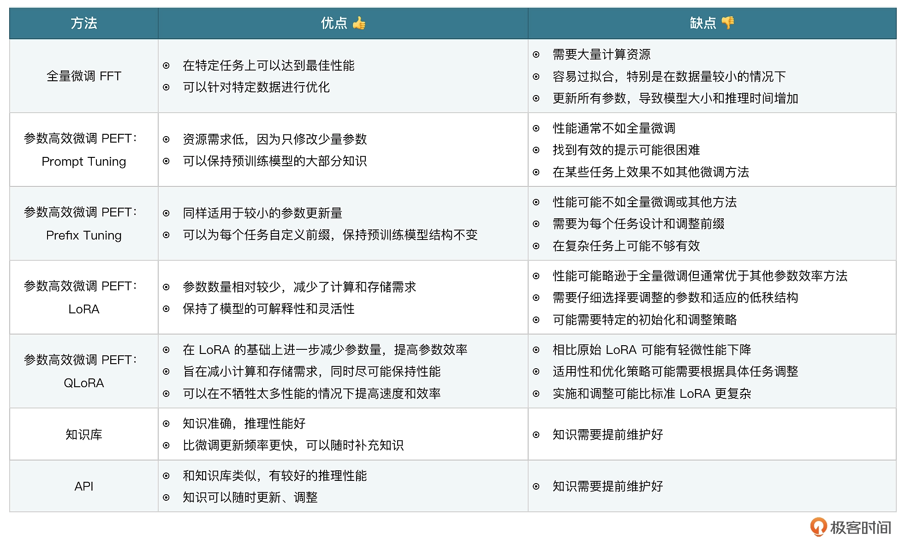
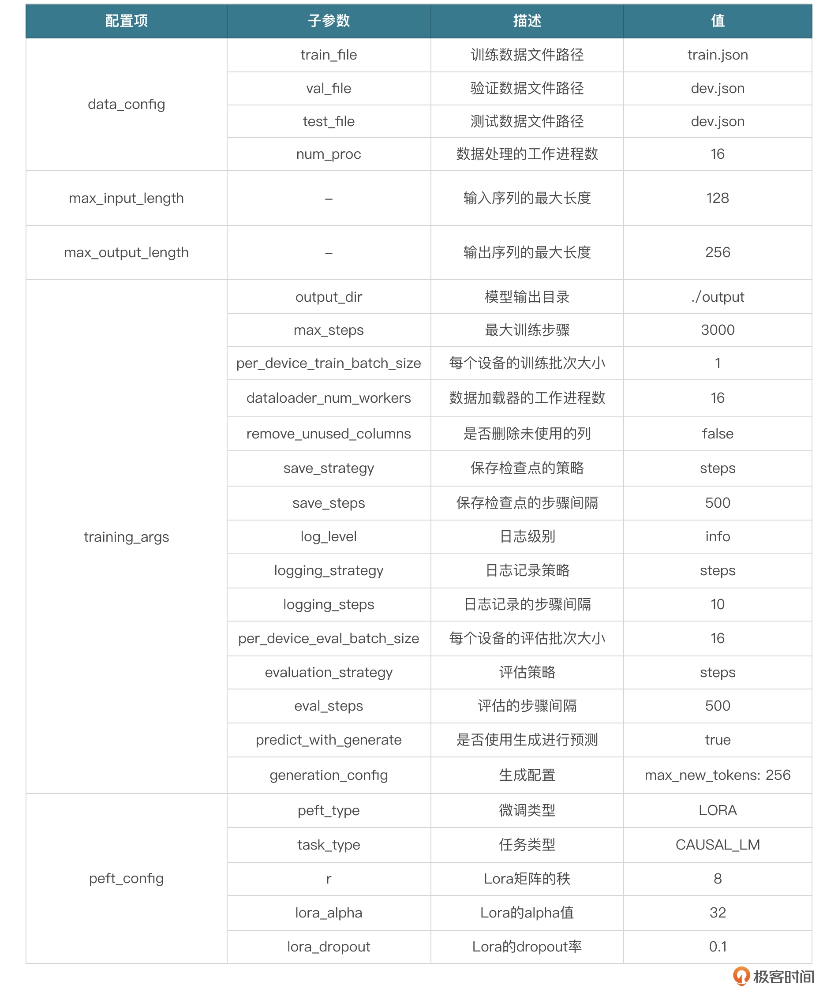

# 如何增强模型能力？
- **微调**是一种让预先训练好的模型适应特定任务或数据集的方案，成本相对较低，这种情况下，模型会学习训练者提供的微调数据，并且具备一定的理解能力。
- **知识库**使用向量数据库或者其他数据库存储数据，为大语言模型提供信息来源外挂。
- **API** 和知识库类似，为大语言模型提供信息来源外挂。

# 微调
常见微调模式

- 落地过程
1. 微调：准备数据、微调、验证、提供服务。
2. 知识库：准备数据、构建向量库、构建智能体、提供服务。
3. API：准备数据、开发接口、构建智能体、提供服务。

## 数据来源
1. github 上的开源数据集
    如： https://github.com/SophonPlus/ChineseNlpCorpus/tree/master/datasets
2. huggingFace 上的 datasets
    https://huggingface.co/datasets
3. 也可以通过爬虫等，收集自己需要的数据集
可以将 csv 文件直接下载到本地，通过 python 脚本，将数据集格式化为 模型训练需要的数据集格式

可以借助 datasets 进行数据集的加载
https://huggingface.co/docs/datasets/index

## lora 配置

- 参数：
max_steps: 最大训练轮数
save_steps: 每训练多少轮保存权重
其他参数：

## 微调过程输出参数及含义
- loss：损失函数衡量模型预测的输出与实际数据之间的差异或误差。在训练过程中，目标是最小化这个损失值，从而提高模型的准确性。
- grad_norm（梯度范数）：在训练深度学习模型时，通过反向传播算法计算参数（如权重）的梯度，以便更新这些参数。梯度范数是这些梯度向量的大小或长度，它提供了关于参数更新幅度的信息。如果梯度范数非常大，可能表示模型在训练过程中遇到了梯度爆炸问题；如果梯度范数太小，可能表示存在梯度消失问题。
- learning_rate（学习率）：学习率是一个控制参数更新幅度的超参数。在优化算法中，学习率决定了在反向传播期间参数更新的步长大小。太高的学习率可能导致训练过程不稳定，而太低的学习率可能导致训练进展缓慢或陷入局部最小值。
- epoch（周期）：一个 epoch 指的是训练算法在整个训练数据集上的一次完整遍历。通常需要多个 epochs 来训练模型，以确保模型能够充分学习数据集中的模式。每个 epoch 后，通常会评估模型在验证集上的表现，以监控和调整训练过程。

## 验证
使用验证脚本

## 提供服务
实际生产，需要考虑的几个点：
1. 模型的推理性能、推理效果
2. 推理吞吐量
3. 服务的限流。适当保护大模型集群
4. 服务降级，当模型不可用时，可以考虑通过修改开关，将 AI 小助手隐藏暂停使用
