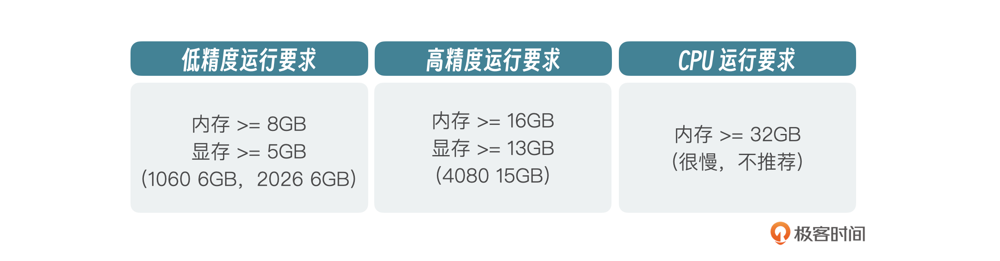
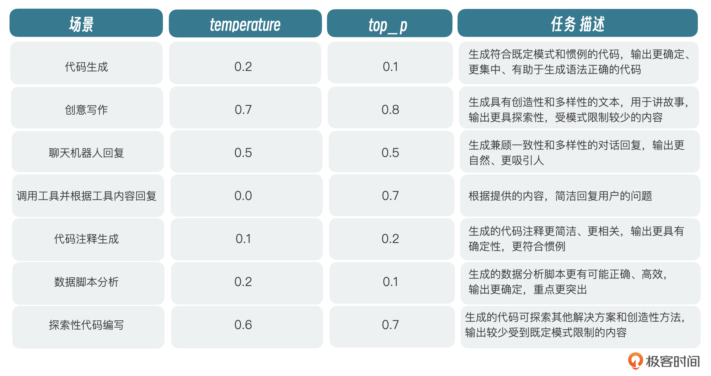

# 基于 model 的 各类 demo
https://github.com/wohy/ChatGLM3/tree/main
源仓库
git clone https://github.com/THUDM/ChatGLM3

# 环境
GLM3-6B 运行需要的环境

python、transformers、Torch

# model 加载
借助 huggingface：
https://huggingface.co/THUDM/chatglm3-6b
可以直接 git clone 到本地，进行运行
也可以直接借助 transformers
```py
# Load model directly
from transformers import AutoModel
model = AutoModel.from_pretrained("THUDM/chatglm3-6b", trust_remote_code=True)
```
也可以借助 ollama 直接运行
## 参数调节
如果电脑的 GPU 显存不足，或者只有 cpu
可以通过调节参数，更改精度，或者更改加载方式
- 如：
1. 默认情况下，模型以 FP16 精度加载，大概需要 13GB 显存。如果你的电脑没有 GPU，只能通过 CPU 启动，6B 也是支持的，需要大概 32G 的内存。我们修改一下模型加载脚本。
```py
model = AutoModel.from_pretrained(MODEL_PATH trust_remote_code=True).float()
```
2. 如果你的电脑有 GPU，但是显存不够，也可以通过修改模型加载脚本，在 4-bit 量化下运行，只需要 6GB 左右的显存就可以进行流程推理。
```py
model = AutoModel.from_pretrained(MODEL_PATH, trust_remote_code=True, ).quantize(4).cuda()
```

## ChatGLM3 的几个超参数含及推荐设置
1. max_length：模型的总 token 限制，包括输入和输出的 tokens。
2. temperature：模型的温度。温度只是调整单词的概率分布。它最终的宏观效果是，在较低的温度下，我们的模型更具确定性，而在较高的温度下，则不那么确定。数字越小，给出的答案越精确。
3. top_p：模型采样策略参数。每一步只从累积概率超过某个阈值 p 的最小单词集合中进行随机采样，而不考虑其他低概率的词。只关注概率分布的核心部分，忽略了尾部。



# GLM3 的对话场景 prompt 格式
## 对话场景
有且仅有以下三种角色：
1. system: 系统信息，出现在消息的最前面，可以指定回答问题的角色
2. user： 用户提问
3. assistant： 大模型回复
## 代码场景
则多了一个 ``observation`` 角色，为外部返回的结果，如调用外部的 API ，代码执行逻辑等返回结果，assistant 会结合 observation 的结果进行 回复的优化。
- 例如：
```py
<|system|>
Answer the following questions as best as you can. You have access to the following tools:
[
    {
        "name": "get_current_weather",
        "description": "Get the current weather in a given location",
        "parameters": {
            "type": "object",
            "properties": {
                "location": {
                    "type": "string",
                    "description": "The city and state, e.g. San Francisco, CA",
                },
                "unit": {"type": "string"},
            },
            "required": ["location"],
        },
    }
]
<|user|>
今天北京的天气怎么样？
<|assistant|>
好的，让我们来查看今天的天气
<|assistant|>get_current_weather
# python 代码执行，获取摄氏温度
tool_call(location="beijing", unit="celsius")

<|observation|>
{"temperature": 22}
<|assistant|>

根据查询结果，今天北京的气温为 22 摄氏度。
```

## 角色设置意义
1. 系统消息，不算用户对话中的一部分，大模型与用户隔离，但是可以控制模型与用户交互的范围，比如在 system 中指定模型充当某领域专家时，就可以指导模型的输出偏向于该领域范围内
2. 防止用户进行输入注入攻击，自回归模型，会根据上下文进行内容推理，当用户给出错误提示时，模型将会一直在上下文中带上该提示，从而输出错误内容。角色可以使内容更容易区分，增加了注入攻击的复杂度。

# tokenizer 和 model 的引用


