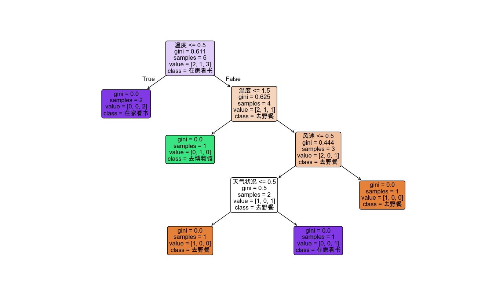
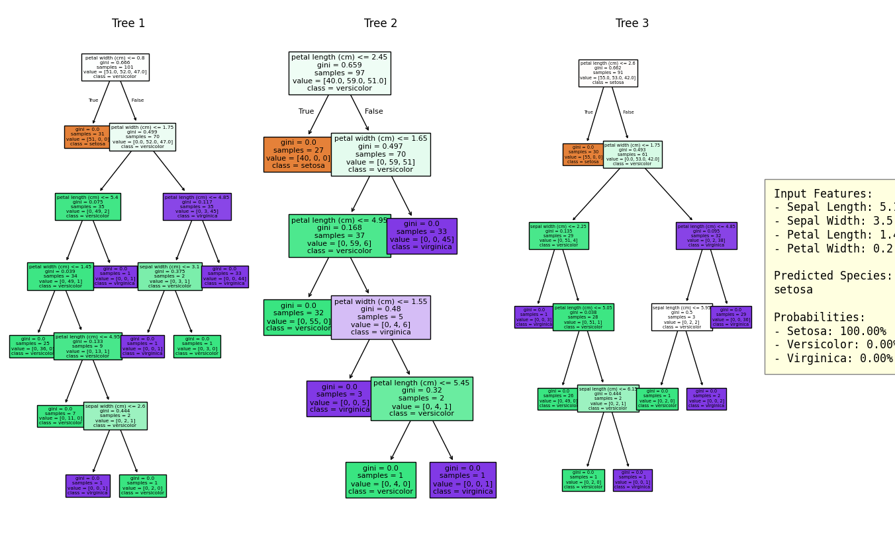
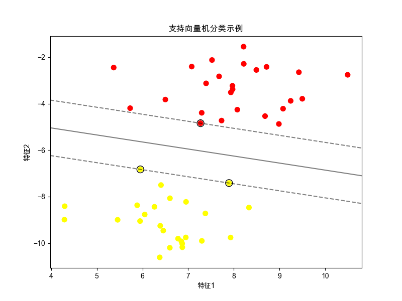
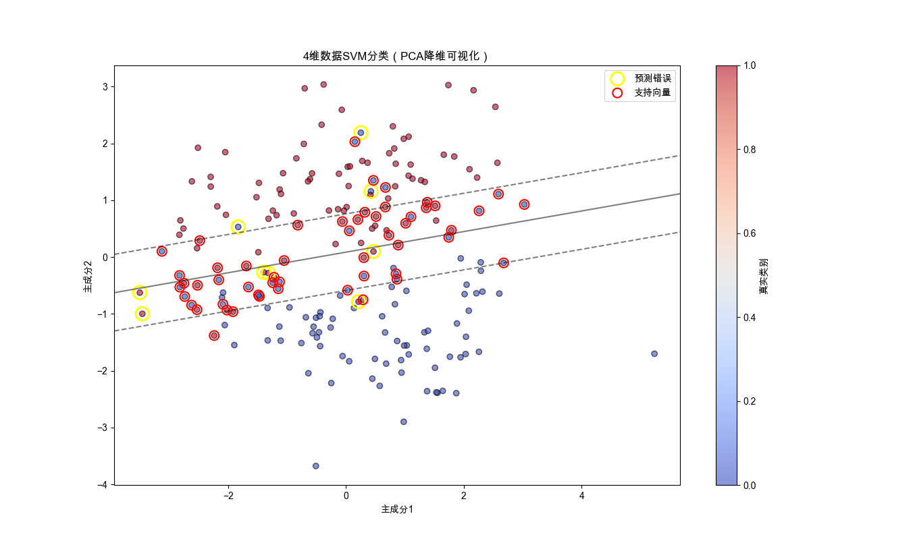
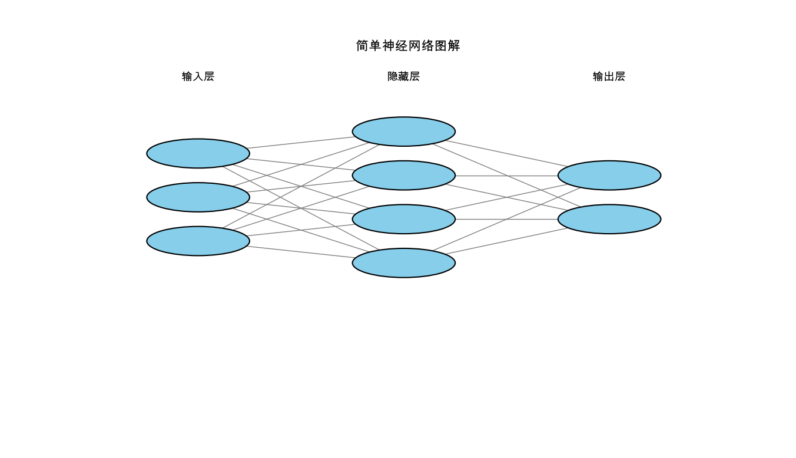

# 经典算法
## 决策树
分类和回归
一个 “是否游戏”：问对方问题，对方只能回答 是 或 否，通过问尽可能少的问题，得到问题的答案
### 实例
根据天气情况、温度、和风速决定进行什么活动，比如宅在家还是出去玩，我们准备一些简单的数据集：
- 天气
    - 状况： 晴天（0）  阴天（1） 雨天（2）
    - 温度： 低（0） 中（1） 高（2）
    - 风速： 无风（0） 微风（1） 大风（2）
- 活动：
    - 野餐（0）
    - 去博物馆（1）
    - 在家看书（2）
- 样本如下：
```py
# 创建数据集
X = np.array([
    [0, 2, 0],  # 晴天，高温，无风
    [1, 1, 1],  # 阴天，中温，微风 
    [2, 0, 2],  # 雨天，低温，强风
    [1, 2, 0],  # 阴天，高温，无风
    [1, 2, 1],  # 阴天，高温，微风
    [2, 1, 2],  # 雨天，低温，强风
])
y = np.array([0, 1, 2, 2, 0, 2])  # 分别对应去野餐、去博物馆、在家看书、在家看书、去野餐、在家看书
plot_tree(clf, filled=True, feature_names=["天气状况", "温度", "风速"], class_names=["去野餐", "去博物馆", "在家看书"], rounded=True, fontsize=12)
```
根据该实例，列举多个样本，通过 sklearnTree.py 生成的决策树如下：


### 参数
#### 1. Gini 指数（基尼不纯度）
1. **什么是 Gini 指数？**
Gini 指数（基尼不纯度）是决策树中用来衡量一个数据集合的“纯度”的指标。通俗来说，它反映了从数据中随机抓两个样本，这两个样本属于不同类别的概率。  
• **越纯净的数据集**：比如全班同学都是男生，Gini 指数为 0（因为随便抓两个人都是同一类）。  
• **越混杂的数据集**：比如班级里男女各占一半，Gini 指数接近 1（抓两个人很可能性别不同）。
如上数据集，根节点的样本有 6 个，其中 去野餐 的样本有 2 个，概率为 1/3，去博物馆 的样本有 1 个，概率为 1/6，在家看书 的样本有 3 个，概率为 1/2
计算出根节点的 Gini 指数为： 1 - （1/3）^ 2 - (1/6) ^ 2 - (1/2) ^ 2 = 0.611
- 作用：
决策树，会选择让 Gini 指数下降最多的特征进行分裂。如上样本中，根节点通过 ``温度 <= 0.5``，可以直接分裂出两个相同样本 [2, 0, 2]，即得到 Gini 为 0，所以根节点，会根据是否 ``温度 <= 0.5`` 进行分裂


#### 2. samples
表示到达这个节点的样本数量
如上数据集，根节点的 samples 即为 6， 总共有 6 个样本

#### 3. value
展示当前节点中，不同类别的样本数量。
如上数据集，为分类问题，根节点的6个样本中，去野餐的有 2 个，去博物馆的有 1 个，在家看书的有 3 个，根据 class_names 约定的排列，得到 根节点 的 value = [2, 1, 3]
- 作用：帮助判断哪个类别占多数，从而决定预测结果。

#### 4. class
当前节点样本中的大多数，即节点最终的 “答案”
如上数据集，根节点的 6个样本中，大多数结果都为 “在家看书”，所以根节点的 class = “在家看书”


## 随机森林
随机森林通过构建多个决策树来进行预测，其基本思想是集体智慧——单个模型可能有限，但多个模型集合起来可以作出更好的判断。随机森林算法的关键在于它的随机性。
### 随机性
1. 样本随机性：每棵树训练的数据通过从原始数据中进行随机抽样得到，这种方法称为自助采样。
2. 特征随机性：在分裂决策树的节点时，算法会从所有特征中随机选取一部分特征，然后只在这些随机选取的特征中寻找最优分裂特征。
这种随机性使随机森林模型具有很高的准确性，同时也能防止模型过拟合。

### 随机森林的工作原理。
1. 从原始数据集中随机抽样选取多个子集。
2. 对每个子集训练一个决策树。
3. 每棵树独立进行预测。
4. 最终预测结果是所有的树预测结果的投票或平均。

### 举例
通过 ​鸢尾花数据集（Iris Dataset）来生成随机森林
#### **1. 包含的 3 个鸢尾花种类（类别标签）**
| 名称                  | 拉丁学名           | 特点（简）                          |
|-----------------------|--------------------|-----------------------------------|
| **山鸢尾**            | *Iris setosa*      | 花朵小，萼片宽大，易与其他两类区分。 |
| **变色鸢尾**          | *Iris versicolor*  | 中等大小，花瓣颜色渐变，萼片与花瓣接近。 |
| **维吉尼亚鸢尾**      | *Iris virginica*   | 花朵最大，花瓣宽，萼片边缘褶皱。      |

**数据分布**：每个种类各 **50 个样本**，共 **150 个样本**。

---

#### **2. 每个样本的 4 个数值特征**
| 特征名称              | 描述                   | 单位 | 作用（分类意义）                     |
|-----------------------|------------------------|------|------------------------------------|
| **萼片长度**          | 萼片（外层花瓣状结构）的长度 | cm   | 区分 *setosa*（最短）和 *virginica*（最长）。 |
| **萼片宽度**          | 萼片的宽度             | cm   | *setosa* 的萼片最宽。               |
| **花瓣长度**          | 花瓣（内层彩色结构）的长度 | cm   | 关键区分特征（*setosa* 最短，*virginica* 最长）。 |
| **花瓣宽度**          | 花瓣的宽度             | cm   | *virginica* 的花瓣最宽。             |

#### 生成的随机森林即使用示例：
randomForest



## 支持向量机（SVM）
强大的分类算法
找到一个最优的决策边界，或者称为“超平面”，这个边界能够以最大的间隔将不同类别的数据分开
### 举例
线性支持向量机
二维特征，分界线有最接近该分界线最近的两个点（支持向量）决定的

四维特征：


### 通俗理解
---

#### **1. 通俗类比**
想象你是一名**城市规划师**，要在两个社区之间修一条路：  
• **SVM 的修路原则**：  
  1. 让这条路尽可能**宽**（最大间隔），减少未来车辆剐蹭（分类错误）。  
  2. 修路时**只参考靠近边界的房屋位置**（支持向量），其他房屋不影响路线。  
  3. 如果社区形状复杂（如螺旋形），就用“空间折叠”技术（核函数）把地形拉直再修路。

---

---

#### **2. 关键概念拆解**
**① 超平面（分界线）**  
• **二维数据**：一条直线（比如 `y = ax + b`）。  
• **三维数据**：一个平面。  
• **高维数据**：抽象的分割面（统称“超平面”）。  

**② 间隔（Margin）**  
• 分界线到两侧最近数据点的距离之和。  
• **SVM 的目标**：找到**间隔最大**的分界线

**③ 支持向量（Support Vectors）**  
• 离分界线最近的那些数据点。  
• **核心作用**：分界线的位置**只由支持向量决定**，其他数据点移动不影响结果。

---

#### **3. 如何处理非线性数据？用“魔法”扭曲空间！**
**问题**：如果数据像螺旋形或环形，一条直线永远分不开。  
**解决方法**：**核函数（Kernel Trick）**  
• **比喻**：戴上“魔法透镜”，把数据投射到更高维空间，让它们变得线性可分。  
• **例子**：  
  平面上的一堆同心圆，无法用直线分开 → 用核函数映射到三维空间（增加“半径”维度），变成一个平面切分问题（如图3）。  
• **常用核函数**：  
  • 线性核（直接切分）  
  • 高斯核（类似“以每个数据点为圆心画圈”）  
  • 多项式核（用曲线分割）

---

#### **4. 软间隔：允许少量“违建”**
**现实情况**：数据可能有噪声（比如错误标签或离群点）。  
**解决方案**：允许分界线附近少量数据点“越界”，但要惩罚这些错误。  
• **控制参数**：`C` 值（类似“容忍度调节器”）。  
  • `C` 越大 → 越不容忍错误（间隔变窄，容易过拟合）。  
  • `C` 越小 → 越宽容错误（间隔变宽，泛化性更好）。

---

#### **5. SVM 适合什么场景？**
• **数据特点**：  
  • 样本量不大但特征多（比如基因数据、文本分类）。  
  • 边界清晰或需要高可靠性分类（比如人脸识别、医疗诊断）。  
• **优势**：  
  • 高维数据处理能力强（核函数魔法）。  
  • 依赖少量支持向量，内存效率高。  
• **劣势**：  
  • 大规模数据训练慢。  
  • 核函数和参数需要调优（像选不同魔法透镜）。

---

### 核心作用：用“最大间隔”原则找最佳分界
1. **分类任务**  
   将数据点划分到不同类别，例如：
   • **垃圾邮件识别**：区分正常邮件（+1）和垃圾邮件（-1）。
   • **医学诊断**：根据肿瘤特征判断良性（A类）或恶性（B类）。

2. **回归任务**  
   预测连续值（如房价、温度），但更常用于分类。

---

### SVM 的三大独特优势
#### 1. **高维数据处理能力**  
   • **核技巧（Kernel Trick）**：通过将数据映射到高维空间，解决低维空间中线性不可分的问题。  
   • **例子**：  
     ◦ **图像识别**：将像素数据映射到高维空间，区分猫和狗的照片。  
     ◦ **文本分类**：将词语向量化后，区分新闻类别（体育、政治）。

#### 2. **小样本高精度分类**  
   • 依赖少量**支持向量**（关键样本点）即可确定分界，适合数据量小的场景。  
   • **例子**：  
     ◦ **基因数据分类**：仅几十个样本但上千个基因特征，SVM 可有效提取关键基因。

#### 3. **抗过拟合能力**  
   • **最大化间隔**：分界面远离所有类别数据，降低噪声干扰。  
   • **正则化参数（C）**：控制对分类错误的容忍度，平衡模型复杂度。  
   • **例子**：  
     ◦ **信用卡欺诈检测**：即使部分交易数据存在噪声，SVM 仍能保持高准确率。

---

### 实际应用场景
1. **图像识别**  
   • 人脸识别、手写数字识别（如邮政编码自动识别）。

2. **自然语言处理**  
   • 情感分析（判断评论是正面/负面）、垃圾邮件过滤。

3. **生物信息学**  
   • 蛋白质结构分类、疾病基因预测。

4. **金融风控**  
   • 贷款风险评估、股票市场趋势预测。

---

### 与其它算法的对比
| **场景**                | **SVM 优势**                          | **其他算法（如决策树、神经网络）的局限**       |
|-------------------------|--------------------------------------|---------------------------------------------|
| 小样本、高维数据         | 核技巧高效处理高维特征                | 决策树容易过拟合，神经网络需要大量数据         |
| 需要强解释性             | 支持向量直接反映关键样本               | 神经网络的黑箱特性难以解释                   |
| 数据存在复杂非线性边界   | 高斯核自动拟合复杂分布                 | 线性回归、逻辑回归无法直接处理非线性问题       |

---


### 总结  
SVM 是解决**小样本、高维、非线性分类问题**的利器，通过最大化分类间隔和核技巧，在复杂数据中构建鲁棒的决策边界。它像一名“边界规划专家”，既追求精确分类，又确保模型泛化能力，广泛应用于需要高可靠性的领域（如医疗、金融）。

SVM（支持向量机）算法的主要作用是通过构建一个**最优分类边界**，解决数据的分类和回归问题。它在复杂数据分布中寻找**平衡精度与泛化能力**的最佳分界方式


## 神经网络
现在主流的大部分大模型都是基于深度神经网络的。主要设计思路是模仿人的大脑，由许多小的、处理信息的单位组成，这些单位就是神经元，各神经元之间彼此连接，每个神经元可以向其他神经元发送和接收信号。通过这种方式，神经网络能够执行各种复杂的计算任务，比如图像和语音识别、自然语言处理以及许多其他类型的机器学习任务。

一个简单的神经网络包含三层：输入层、隐藏层和输出层。一般情况下，一个神经网络输入层和输出层仅有一层，隐藏层可以有多层，不过也有特殊情况
### 分层
- 输入层：接收原始数据输入，例如图片的像素值或者一段文本的编码。
- 隐藏层：处理输入数据，可以有一个或多个隐藏层。隐藏层的神经元会对输入数据进行加权和，应用激活函数，这个过程可以捕捉输入数据中的复杂模式和关系。
- 输出层：根据隐藏层的处理结果，输出一个值或一组值，代表了神经网络的最终预测结果。

在深度神经网络中，不同的层可以学习不同的特征，较低的层可能学习简单的特征，较高的层则可以学到更复杂的概念。这种从简单到复杂的学习过程使得神经网络非常适合处理复杂的数据结构。

### 举例了解 激活函数、前向传播、反向传播、梯度下降 概念
- 假设需要做一道菜，而神经网络就是你的厨房，厨房里有各种炊具和调料，代表着神经网络的各个组成部分。
1. 食材：类比神经网络的输入数据
2. 调味：激活函数，赋予食材不同的特征和味道
3. 烹饪过程：前向传播，根据菜谱和经验，按照一定的步骤和方法进行的烹饪过程。在前向传播中，神经网络逐层处理输入数据，通过各种操作和激活函数的作用，逐渐提取并组合数据的特征，最终得到输出结果。
4. 味道调整：训练过程，尝试不同的调料和烹饪技巧，调整菜的味道，直到达到满意的效果。在神经网络的训练过程中，我们通过反向传播算法来调整网络参数，使得网络的输出尽可能接近真实标签，达到最佳的预测效果。
5. 品尝和反馈：反向传播，尝试做好的菜品，并根据味道来调整调料的用量和烹饪方法。在神经网络中，反向传播就像是品尝和反馈过程，通过计算模型输出与真实标签之间的差距（损失函数），并利用链式法则逆向传播这个误差，以调整每一层的参数，使得网络的输出更接近真实标签。
6. 调整火候：梯度下降，根据实际情况调整火候，使菜肴烹饪得更加均匀和完美。而在神经网络的训练中，梯度下降就像是调整火候，它是一种优化算法，通过不断沿着梯度的反方向调整参数，逐步降低损失函数，使得网络的预测效果逐渐提升，达到最优的训练效果。
7. 评价口感：损失函数，在烹饪过程中，根据菜肴的味道、口感等因素来评价菜品的好坏。而在神经网络中，损失函数就像是评价口感的标准，它衡量了模型的输出与真实标签之间的差距，即模型的预测效果，损失函数越小表示模型的预测越接近真实标签。


### 举例简易神经网络
neural_network



# 过拟合 和 泛化 概念
### 过拟合
通俗的讲：就像学渣考试前死记硬背答案，结果考试时题目稍微一改就懵了，成绩反而比不复习还差。
- 表现：模型在训练数据上准确率极高（比如记住每一条历史天气的细节），但在新数据上一塌糊涂。
- 原因：
    - ​模型太复杂：比如用100层神经网络去拟合10条简单数据。
    - ​数据太少：比如只见过3种天气，硬要总结出20条规律。
- ​例子：
一个过拟合的天气预测模型，可能因为某次“周二下午刮东风时下雨”，就认定所有周二下午刮东风都会下雨，而忽略真正重要的因素（比如湿度）。
- 现实中的过拟合陷阱
    - ​医疗诊断：模型用100个病人的数据训练，发现“名字带‘芳’的人容易得流感”，结果新病人叫“小芳”就被误诊。
    - ​股票预测：模型根据历史数据总结出“每年3月第2个周四必涨”，结果今年政策变化，规律失效。

### 泛化能力
通俗的讲：就像学霸考试时，​真正理解了知识，遇到没见过的题目也能举一反三，正确解答。
- 模型的目标：不是死记硬背训练数据，而是学规律​（比如“晴天适合野餐”）。
- 好的泛化：模型在新数据​（没见过的天气）上也能准确预测（比如判断明天该去野餐还是在家看书）。
- 重要性：模型最终要在现实中使用（比如预测股票、诊断疾病），必须能应对未知情况。

### 如何提升泛化能力
- 简化模型：
    - 决策树：限制树的最大深度（比如最多分5层，不让它死磕细节）。
    - 神经网络：减少神经元数量。
- ​增加数据：
    收集更多天气样本，让模型看到更多可能性。
- ​正则化：
    给模型“上枷锁”，惩罚复杂规则（比如规定“湿度>80%”比“周二下午刮东风”更重要）。
- ​交叉验证：
    把数据分成多份，轮流用其中一份测试，确保模型学的是通用规律。


