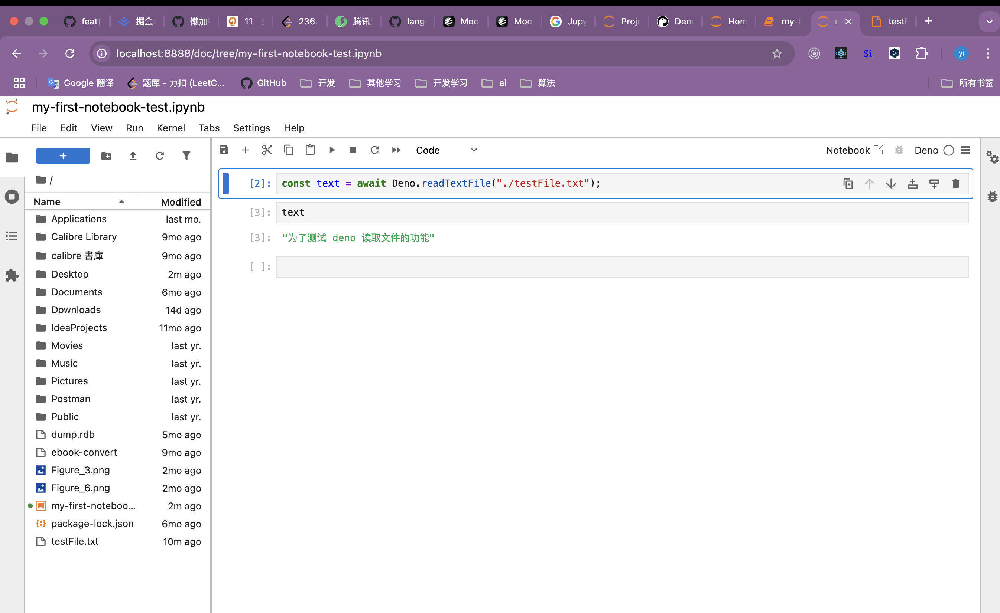
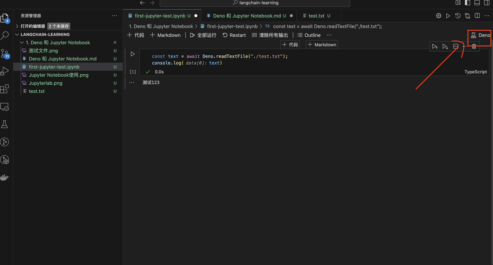

# Deno
更强大的 nodejs
整合很多 nodejs 中需要配置才能拥有的功能
整合了 nodejs 分散的生态

https://deno.com/

# Jupyter Notebook 中使用 deno 环境
Jupyter Notebook 项目开始以 python 为主，后续 deno 提供了 js/ts Kernel 的支持，所以我们需要分别安装这两个。这里以 Mac 环境演示，如果是 win/linux 可以参考后附的链接进行安装。

https://jupyter.org/install

首先我们需要本地有 python 环境，最好是 3.9 及以上的 python 环境。在配置好 python 环境后，然后安装 Jupyter Notebook：

```bash
pip install notebook
```
如果你本地 python3 的 pip 别名是 pip3，那就需要：
```bash
pip3 install notebook
```

然后在本地安装 Deno 环境：

```bash
curl -fsSL https://deno.land/install.sh | sh
```

安装完毕 Deno 环境后，使用 deno 为 Jupyter Notebook 配置 kernel：

```bash
deno jupyter --unstable --install
```

然后通过运行以下命令，验证 kernel 是否配置完成：

```bash
deno jupyter --unstable
```

显示以下即为配置成功：


然后我们运行以下命令启动 notebook：

```bash
jupyter notebook
```

然后就会自动打开一个网页，然后我们就可以正常使用 notebook 了。





# 还可直接在 vscode 中，通过 Jupyter 扩展来编写 Jupyter 代码
新建 一个 .ipynb 文件，选择内核 为 deno
