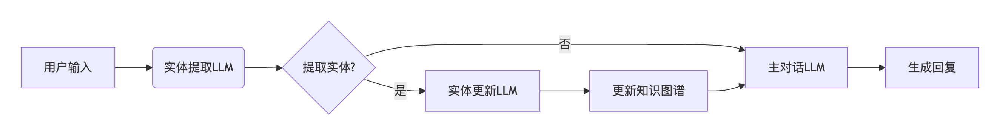
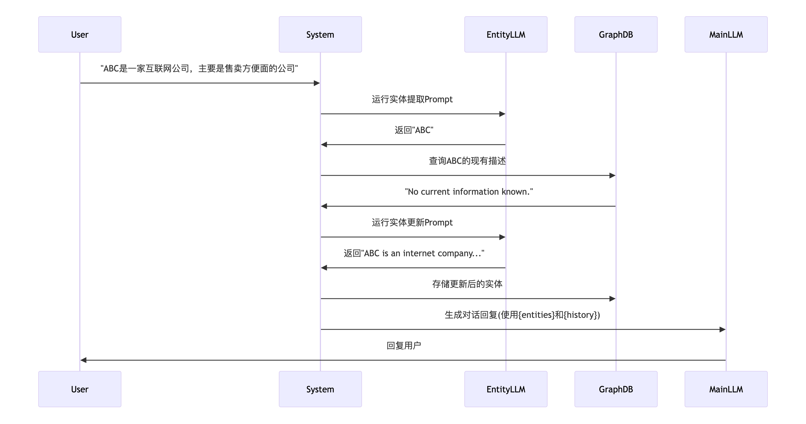

# 一个 LLM 如何在 chat 中记忆沟通的上下文？
无脑的记忆所有的上下文，肯定会很容易超出 LLM 的上下文窗口大小，也会浪费大量的 Token 资源

# 具体示例见 Memory.ipynb

## ChatMessageHistory
chat history 就是一组 Message 子类对象组成 List，Message 的子类对象包括 HumanMessage 和 AIMessage, Memory 即是构建在 chat history 之上的概念。

chat history 聊天历史， Memory 处理后的聊天历史

LLM 是无状态的，他并不会存储我们的聊天历史，聊天历史是我们自行存储，并传递给 LLM 上下文的一部分

## 手动维护 chat history 简易做法
1. 在 prompt 的 template 中使用 MessagesPlaceholder 创建一个后续可替换为 history 的插槽 history_message
```js
import { ChatPromptTemplate, MessagesPlaceholder } from "@langchain/core/prompts";
import { ChatOpenAI } from "@langchain/openai";

const chatModel = new ChatOpenAI();
const prompt = ChatPromptTemplate.fromMessages([
    ["system", `You are a helpful assistant. Answer all questions to the best of your ability.
    You are talkative and provides lots of specific details from its context. 
    If the you does not know the answer to a question, it truthfully says you do not know.`],
    new MessagesPlaceholder("history_message"),
]);

const chain = prompt.pipe(chatModel);

```
2. 通过 history.addMessage 手动维护 chat history， invoke 时手动将 聊天记录赋值给 插槽 history_message
```js
import { ChatMessageHistory } from "langchain/stores/message/in_memory";
import { HumanMessage, AIMessage } from "@langchain/core/messages";

const history = new ChatMessageHistory();
await history.addMessage(new HumanMessage("hi, my name is Kai"));

const res1 = await chain.invoke({
    history_message: await history.getMessages()
})

```

## 自动维护 chat history
使用 RunnableWithMessageHistory 给任意 chain 包裹起来，就能添加聊天记录管理的功能，自动记录 chat history
```js
const chatModel = new ChatOpenAI();
const prompt = ChatPromptTemplate.fromMessages([
    ["system", "You are a helpful assistant. Answer all questions to the best of your ability."],
    new MessagesPlaceholder("history_message"),
    ["human","{input}"]
]);

const history = new ChatMessageHistory();
const chain = prompt.pipe(chatModel)

const chainWithHistory = new RunnableWithMessageHistory({
  runnable: chain,
  getMessageHistory: (_sessionId) => history,
  inputMessagesKey: "input",
  historyMessagesKey: "history_message",
});

```

- `RunnableWithMessageHistory` 有几个参数：
    - runnable 就是需要被包裹的 chain，可以是任意 chain
    - getMessageHistory 接收一个函数，函数需要根据传入的 `_sessionId`，去获取对应的 ChatMessageHistory 对象，这里我们没有 session 管理，所以就返回默认的对象
    - inputMessagesKey 用户传入的信息 key 的名称，因为 RunnableWithMessageHistory 要自动记录用户和 llm 发送的信息，所以需要在这里声明用户以什么 key 传入信息
    - historyMessagesKey，聊天记录在 prompt 中的 key，因为要自动的把聊天记录注入到 prompt 中。
    - outputMessagesKey，因为我们的 chain 只有一个输出就省略了，如果有多个输出需要指定哪个是 llm 的回复，也就是需要存储的信息。  


## 实现一个总结 chat history 的chain
langchain 官方也提供了类似的工具 -- `ConversationSummaryMemory`，可直接使用

节省 Token 资源，每次对话，都进行 历史记录 总结的更新，避免使用完整的 chat history
```js
const summaryModel = new ChatOpenAI();
const summaryPrompt = ChatPromptTemplate.fromTemplate(`
Progressively summarize the lines of conversation provided, adding onto the previous summary returning a new summary

Current summary:
{summary}

New lines of conversation:
{new_lines}

New summary:
`); 

const summaryChain = RunnableSequence.from([
    summaryPrompt,
    summaryModel,
    new StringOutputParser(),
])
```


## 使用 RunnableSequence 
```js
const chatModel = new ChatOpenAI();
const chatPrompt = ChatPromptTemplate.fromMessages([
    ["system", `You are a helpful assistant. Answer all questions to the best of your ability.

    Here is the chat history summary:
    {history_summary}
    `],
    ["human","{input}"]
]);
let summary = ""
const history = new ChatMessageHistory();

const chatChain = RunnableSequence.from([
    {
        input: new RunnablePassthrough({
             func: (input) => history.addUserMessage(input)
        })
    },
    // `RunnablePassthrough.assign` 是在不影响传递上一节点信息的基础上，再添加一部分信息。这里就是保留上一节点传递下来的 input 值
    RunnablePassthrough.assign({
        history_summary: () => summary
    }),
    chatPrompt,
    chatModel,
    new StringOutputParser(),
    new RunnablePassthrough({
        func: async (input) => {
            history.addAIChatMessage(input)
            const messages = await history.getMessages()
            const new_lines = getBufferString(messages)
            const newSummary = await summaryChain.invoke({
                summary,
                new_lines
            })
            console.log(summary, input, messages, new_lines, newSummary)
            history.clear()
            summary = newSummary      
        }
    })
])
```
### RunnablePassthrough
以理解是 runnable chain 中的特殊节点
在第一个节点中，我们是希望将用户的输入存储到 history 中，并且将 input 原封不动的传递给下一个节点。
在下一个节点中使用 RunnablePassthrough func 中即可接受到上一个节点的 input

这里最后一个节点，在我们再次使用 `RunnablePassthrough` 中的 func 参数，执行几个操作：
- 将 llm 输出的信息添加到 history 中
- 获取 history 中的所有信息，存储到 messages 中
- 使用 getBufferString 函数，把 messages 转换成字符串
- 然后使用 summaryChain 获取新的总结
- 将新的总结存储到 summary 变量中
- 清空 history


## Memory
历史记录 ->  关键记忆

### ConversationChain
```js
import { ChatOpenAI } from "@langchain/openai";
import { BufferMemory } from "langchain/memory";
import { ConversationChain } from "langchain/chains";

const chatModel = new ChatOpenAI();
const memory = new BufferMemory();
const chain = new ConversationChain({ llm: chatModel, memory: memory });
const res1 = await chain.call({ input: "我是小明" });
// { response: "你好，小明！很高兴认识你。我是人工智能，有什么可以帮助你的吗？" }
```

`ConversationChain` 会自动传入一个 history 的属性，是字符串化后的 chat history
`ConversationChain` 没有暴露自定义接口的属性，所以无法修改内部处理逻辑


### 内置的 Memory 机制
#### 1. BufferWindowMemory
```js
const model = new OpenAI();
const memory = new BufferWindowMemory({ k: 1 });
const chain = new ConversationChain({ llm: model, memory: memory });
```
对聊天记录加了一个滑动窗口，只会记忆 k 个对话，这个是很基础的记忆机制

#### 2. ConversationSummaryMemory
```js
import { ConversationSummaryMemory } from "langchain/memory";
import { PromptTemplate } from "@langchain/core/prompts";

const memory = new ConversationSummaryMemory({
    memoryKey: "summary",
    llm: new ChatOpenAI({
          verbose: true,
    }),
  });

const model = new ChatOpenAI();
const prompt = PromptTemplate.fromTemplate(`
你是一个乐于助人的助手。尽你所能回答所有问题。

这是聊天记录的摘要:
{summary}
Human: {input}
AI:`);
const chain = new ConversationChain({ llm: model, prompt, memory, verbose: true });

const res1 = await chain.call({ input: "我是小明" });
const res2 = await chain.call({ input: "我叫什么？" });
```
使用 llm 渐进式的总结聊天记录生成 summary
`verbose: true` 可以看一下内部做了什么

#### 3. 两种机制结合，当 token 数量超出一定限制时，切换为 memory 的机制
```js
import { ChatOpenAI } from "@langchain/openai";
import { ConversationSummaryBufferMemory } from "langchain/memory";
import { ConversationChain } from "langchain/chains";

const model = new ChatOpenAI();
const memory = new ConversationSummaryBufferMemory({
  llm: new ChatOpenAI(),
  maxTokenLimit: 200
});
const chain = new ConversationChain({ llm: model, memory: memory, verbose: true });
```

#### 4. EntityMemory 
动态记忆管理器：提取对话中的实体（如人名/地点），并构建结构化知识图谱。实体更新Prompt的目标是​​增量更新知识图谱​​，若实体无新信息，返回 UNCHANGED 避免冗余存储
```js
import { ChatOpenAI } from "@langchain/openai";
import { EntityMemory, ENTITY_MEMORY_CONVERSATION_TEMPLATE } from "langchain/memory";
import { ConversationChain } from "langchain/chains";

const model = new ChatOpenAI();
const memory = new EntityMemory({
    llm: new ChatOpenAI({
        verbose: true 
    }),
    chatHistoryKey: "history",
    entitiesKey: "entities"
});
const chain = new ConversationChain({ 
    llm: model, 
    prompt: ENTITY_MEMORY_CONVERSATION_TEMPLATE,
    memory: memory, 
    verbose: true 
});

```
---

---

其中 `ENTITY_MEMORY_CONVERSATION_TEMPLATE` 是 langchain 提供的默认用于 EntityMemory chat 的 prompt，预置 prompt 模板：内含 {entities} 和 {history} 占位符，用于动态注入上下文，我们也可以自定义合适的 prompt

- ENTITY_MEMORY_CONVERSATION_TEMPLATE 的真实结构如下（简化）：
```
You are an assistant to a human. Use the following context:
Known entities: {entities}
Conversation history: {history}
Human: {input}
AI:
```
它仅负责​​对话生成

---

进行一次对话后：
```js
const res1 = await chain.call({ input: "我叫小明，今年 18 岁" });
const res2 = await chain.call({ input: "ABC 是一家互联网公司，主要是售卖方便面的公司" });
```

---

EntityMemory 内部用于实体提取的独立 Prompt​​ 内容如下：
```
You are an AI assistant reading the transcript of a conversation between an AI and a 
human. Extract all of the proper nouns from the last line of conversation. As a 
guideline, a proper noun is generally capitalized. You should definitely extract all 
names and places.

The conversation history is provided just in case of a coreference 
(e.g. \"What do you know about him\" where \"him\" is defined in a previous line) -- 
ignore items mentioned there that are not in the last line.\n\nReturn the output as a 
single comma-separated list, or NONE if there is nothing of note to return (e.g. the 
user is just issuing a greeting or having a simple conversation).

EXAMPLE
Conversation history:
Person #1: my name is Jacob. how's it going today?
AI: \"It's going great! How about you?\"
Person #1: good! busy working on Langchain. lots to do.
AI: \"That sounds like a lot of work! What kind of things are you doing to make Langchain better?\"
Last line:
Person #1: i'm trying to improve Langchain's interfaces, the UX, its integrations with various products the user might want ... a lot of stuff.
Output: Jacob,Langchain
END OF EXAMPLE

EXAMPLE
Conversation history:
Person #1: how's it going today?
AI: \"It's going great! How about you?\"
Person #1: good! busy working on Langchain. lots to do.
AI: \"That sounds like a lot of work! What kind of things are you doing to make Langchain better?\"
Last line:
Person #1: i'm trying to improve Langchain's interfaces, the UX, its integrations with various products the user might want ... a lot of stuff. I'm working with Person #2.
Output: Langchain, Person #2
END OF EXAMPLE
```
解析一下：
- 首先第一段去讲清楚任务的背景，一个阅读对话记录，并且从最后一次对话中提取名词的 ai，因为核心目标是英语，这里给了提示，一般专有名词是大写的。并且强调一定提取所有的名词。 这部分给定了任务、任务提示和要求。
- 第二段，强调历史聊天记录仅仅是用于参考，并且再次强调只提取最后一次对话中出现的专有名词，并指定多个专有名词的返回格式和没有任何专有名词的返回格式。
- 然后就是两个例子，第一个例子是普通的例子，主要是用例子更具象化的介绍这个任务。第二个我认为是以 Person \#2 为例强化对名词的概念。 few-shot prompt，也就是通过例子去强化 llm 对任务的理解是常见和效果非常好的技巧
- 最后在 `Conversation history (for reference only)` 再次强化 chat history 只是为了作为参考，`Last line of conversation (for extraction)` 这里才是作为提取的目标

最后，llm 返回："ABC" 
可以看到 llm 只提取了最后一段聊天中的名词

---

之后就是正常的 `ConversationChain` 让 llm 对话的内容
**`ConversationChain` 对话链：自动将 memory 输出的数据整合到 prompt 中**
在聊天之后， EntityMemory 会提取对实体的描述认为，其中 prompt 为：
```
You are an AI assistant helping a human keep track of facts about relevant people, 
places, and concepts in their life. Update and add to the summary of the provided 
entity in the \"Entity\" section based on the last line of your conversation with the 
human. If you are writing the summary for the first time, return a single 
sentence.

The update should only include facts that are relayed in the last line of 
conversation about the provided entity, and should only contain facts about the 
provided entity.

If there is no new information about the provided entity or the information is not worth noting (not an important or relevant fact to remember long-term), output the exact string \"UNCHANGED\" below.

Full conversation history (for context):
Human: 我叫小明，今年 18 岁
AI: 你好，小明！很高兴认识你。你今年18岁，正是年轻有活力的时候。有什么问题我能帮你解答，或者关于什么话题你想和我交谈呢？

Human: ABC 是一家互联网公司，主要是售卖方便面的公司
AI: ABC是一个非常有趣的公司，把互联网技术和方便面销售结合在一起。这两个领域似乎毫不相关，但在这个时代，创新的商业模式正在不断涌现。他们是否有使用特殊的营销策略或技术来提高销售或提高客户体验呢？

Entity to summarize:
ABC

Existing summary of ABC:
No current information known.

Last line of conversation:
Human: ABC 是一家互联网公司，主要是售卖方便面的公司
Updated summary (or the exact string \"UNCHANGED\" if there is no new information about ABC above):
```
这一部分的目的是，根据本次对话用户提到的实体，也就是上一个 prompt 提取出来的实体，去更新 **用户** 提供的实体信息。
- 第一段去强调 llm 的任务，是记录有关实体的信息
- 第二段是将范围控制在用户最新一条信息内，并且只包含跟目标实体有关的内容
- 第三段是指定如果没有更新或者更新并不值得长期记忆，则返回特殊字符 `UNCHANGED`
- 后面这是提供聊天记录、需要记录的实体、当前记录的实体信息，以及跟用户的最后一天聊天记录
然后 llm 就会返回跟实体相关的信息：
```
ABC is an internet company that primarily sells instant noodles.
```
