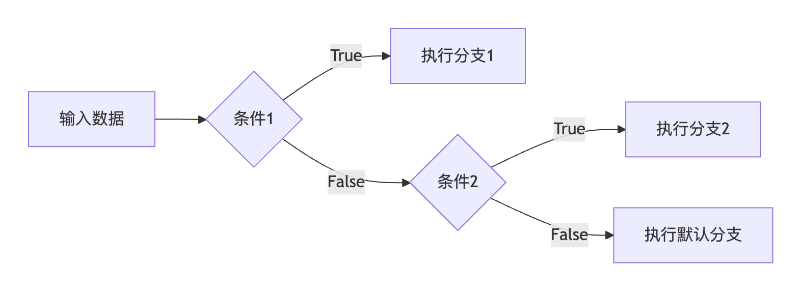

# 什么是 agent
简单来说，就是以 LLM 为引擎，用于实现某项任务的智能实体，拥有 自主感知环境、决策并执行任务 的能力，集成规划、记忆、工具调用能力，实现复杂任务的自动化闭环

# 借用 agent 的思想，可以用于构建不同功能的 chain
典型应用场景​：​​多领域客服系统、智能问答系统
先分析用户的问题，将问题分发到不同的 chain 去解决
## RunnableBranch 的概念
RunnableBranch 是 LangChain 中用于实现​​条件分支逻辑​​的核心组件
它允许开发者根据输入数据的特征动态选择并执行不同的处理路径（即不同的 Runnable 对象），类似于编程中的 if-else 或 switch-case 语句，但以声明式的方式集成在链式工作流中。

```py
RunnableBranch(
   [(条件函数1, Runnable分支1), (条件函数2, Runnable分支2), ...],  # 条件-分支对
   default=Runnable默认分支  # 兜底逻辑
)
```


